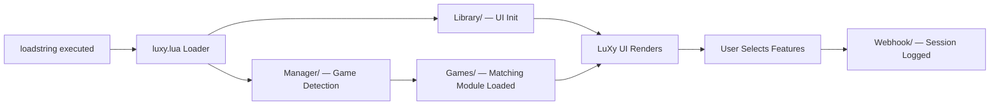

<div align="center">


<br>

**A premium, free script hub for Roblox — built different.**
Custom UI. Modular architecture. Zero compromise.

<br>

[](https://discord.gg/your-invite)
[](https://luxyhub.com)
[](https://github.com/LuxyG15/LuXy_Hub/stargazers)
[](https://github.com/LuxyG15/LuXy_Hub/commits/main)
[](LICENSE)

<br>

**Built With**


<br>


</div>

<br>

## 🌌 What is LuXy Hub?

LuXy Hub is a **premium-grade, completely free, multi-game script hub** for Roblox — engineered with a custom UI library, a modular loader system, and an architecture built to scale across dozens of games without collapsing into chaos.

No key system. No ad-locked links. No "premium tier" gatekeeping the actual good stuff behind a paywall. This is free software built to a standard most paid hubs don't even hit.

> *"Free doesn't have to mean cheap. LuXy proves it."*

<br>

## 💜 Join The Community

<div align="center">

| Platform | Link |
|----------|------|
| 🎮 **Discord** | [discord.gg/your-invite](https://discord.gg/your-invite) |
| 🌐 **Website** | [luxyhub.com](https://luxyhub.com) *(coming soon)* |
| ⭐ **GitHub** | You're already here — drop a star! |

</div>

<br>

## ⚡ Quick Start

Fire this into your executor of choice — Synapse X, Script-Ware, Wave, Xeno, whatever you've got — and you're in.

```lua
loadstring(game:HttpGet("https://raw.githubusercontent.com/LuxyG15/LuXy_Hub/main/luxy.lua"))()
```

<div align="center">

**⚠️ Always load from this repo. Mirrors and reposts are not guaranteed to be safe.**

</div>

<br>

## ✨ Features

<table>
<tr>
<td width="50%">

### 🎮 Multi-Game Engine
One loader, dozens of games. The hub auto-detects what you're running and serves the right module — no manual switching, no separate scripts to manage.

### 🎨 Custom UI Library
Built entirely in-house. Smooth animations, responsive layout, and a premium look that doesn't feel like every other hub running the same recycled UI kit.

### 🔄 Always Up To Date
Every execution pulls straight from GitHub. No re-downloading, no version drift — you're always running the latest build the second it ships.

</td>
<td width="50%">

### 🗂️ Modular Architecture
Clean separation between UI, game logic, and utilities. Built to extend, built to last, built to not break every time a game updates.

### 📡 Webhook Logging
Built-in webhook system for tracking usage and catching issues fast, running quietly in the background.

### 🆓 Actually Free
No key system. No "watch 3 ads to unlock." No premium tier hiding features behind a paywall. This is free, full stop.

</td>
</tr>
</table>

<br>

## 🛡️ Why It's Safe

Trust is earned, not claimed — here's exactly why:

- **🚫 Zero Data Harvesting** — No password grabbing, no credential logging, no silent data exfiltration. The script does what it says and nothing more.
- **📜 Transparent History** — Every update is tracked through commit history and CI pipelines in `.github/workflows`. Nothing ships without a paper trail.
- **👥 Actively Maintained** — Bugs and sketchy behavior get reported and patched fast through Discord and GitHub Issues.
- **🔒 No Hidden Backdoors** — The loader only fetches from this repo's official branch. No third-party redirects, no obfuscated payloads injected mid-load.

<div align="center">

**Still not sure? Ask in Discord before you run anything you're unsure about.**

</div>

<br>

## 📁 Project Structure

```
LuXy_Hub/
├── .github/workflows/     # CI/CD automation & release pipelines
├── .vscode/                # Shared editor configuration
├── Data/                   # Persistent config & stored data
├── FreeCode/               # Standalone free scripts by category
├── Games/                  # Per-game modules & scripts
├── Library/                # LuXy UI — the custom UI library
├── Manager/                # Core loader, game detection & module manager
├── Webhook/                # Logging & notification pipeline
├── Dex.lua                 # Explorer / debug utility
├── luxy.lua                # Main entry point / loader
└── README.md
```
<br>

## 🧭 How It Works



1. **Execution** — `luxy.lua` runs the moment you loadstring it.
2. **UI Init** — The custom UI from `Library/` boots up first, giving instant visual feedback.
3. **Game Detection** — `Manager/` identifies which game you're currently in.
4. **Module Load** — The matching script from `Games/` gets pulled in and wired to the UI.
5. **You're In** — Toggle features, tweak settings, and play. Every session gets logged through `Webhook/` for stability tracking.
6. **Auto-Refresh** — Next time you loadstring, you're automatically on the latest version. No manual updates, ever.

<br>

## 📊 Repo Stats

<div align="center">


</div>

<br>

## 🗺️ Roadmap

- [x] Core loader & multi-game engine
- [x] Custom UI library (LuXy UI)
- [x] Webhook logging system
- [ ] Official website launch
- [ ] In-hub game search & favorites
- [ ] Expanded game library

<br>

## 🤝 Contributing

LuXy Hub grows because people build with it, not just use it.

```bash
1. Fork this repository
2. Create your feature branch   → git checkout -b feature/your-feature
3. Commit your changes          → git commit -m "Add: your feature"
4. Push to your branch          → git push origin feature/your-feature
5. Open a Pull Request
```

Found a bug or have a feature request? Drop it in [Issues](https://github.com/LuxyG15/LuXy_Hub/issues) or bring it up in Discord.

<br>

## 📝 License

This project is licensed under the **MIT License** — see [LICENSE](LICENSE) for full details.

<br>

---

<div align="center">


**Built with 💜 by the LuXy Team**

*If this hub saved you time, a ⭐ on this repo goes a long way.*

</div>
